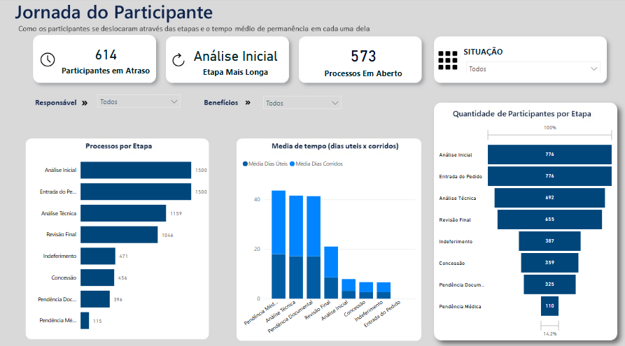
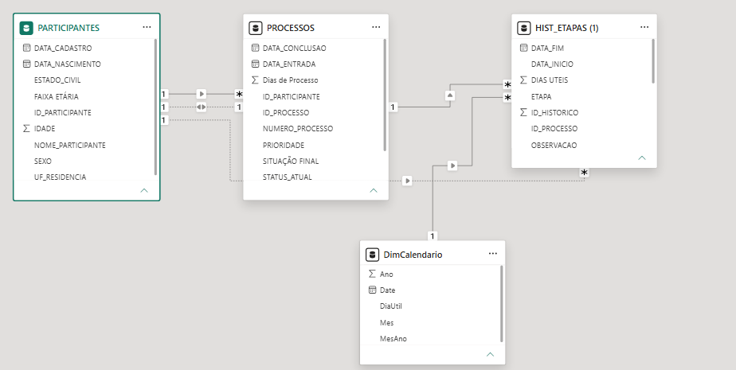

<div align="center">

# 📊 Participant Journey Dashboard

### Power BI • DAX • Power Query • Business Intelligence

Dashboard desenvolvido como solução para um estudo de caso, com foco na análise da jornada do participante por meio de indicadores estratégicos e visualizações interativas.

</div>

---

# 📖 Sobre o Projeto

Este projeto foi desenvolvido como solução para um estudo de caso durante um processo seletivo.

O objetivo foi transformar dados operacionais em informações estratégicas, permitindo identificar gargalos, acompanhar indicadores de desempenho e apoiar a tomada de decisão através de um dashboard desenvolvido no **Power BI**.

Durante o projeto foram aplicadas técnicas de modelagem de dados, criação de medidas em DAX, tratamento de dados e construção de visualizações voltadas para análise de processos.

---

# 🎯 Objetivos

- Monitorar a jornada do participante
- Identificar gargalos operacionais
- Comparar dias corridos e dias úteis
- Criar indicadores para apoio à gestão
- Facilitar a tomada de decisão através de dashboards

---

# 🛠 Tecnologias Utilizadas

<p align="center">


</p>

---

# 📈 Principais Indicadores

- Tempo médio por etapa
- Dias úteis × Dias corridos
- Etapa com maior tempo de permanência
- Participantes com atraso
- Tempo de permanência por etapa
- Funil da jornada
- Indicadores de desempenho (KPIs)

---

# 🧠 Soluções Desenvolvidas

Durante o desenvolvimento deste dashboard foram implementadas:

- Modelagem de dados relacional
- Criação de medidas em DAX
- Cálculo de dias úteis
- Integração entre tabelas
- KPIs dinâmicos
- Tooltips personalizados
- Storytelling com dados

---

# 💡 Principais Insights

A análise permitiu identificar que:

- A etapa de **Análise Técnica** apresentou o maior tempo de permanência.
- A comparação entre dias úteis e dias corridos evidenciou períodos de espera sem atividade operacional.
- O uso de tooltips personalizados facilitou a identificação dos participantes com maior tempo de espera em cada etapa.

---

# 📸 Dashboard

<p align="center">



</p>

---

# 🗂 Modelo de Dados

<p align="center">



</p>

---

# 📚 Aprendizados

Durante este projeto desenvolvi habilidades em:

- Power BI
- DAX
- Power Query
- Modelagem de Dados
- Storytelling com Dados
- Construção de KPIs
- Dashboards Executivos

---

# 📁 Estrutura do Projeto

```text
powerbi-participant-journey
│
├── dashboard/
│   └── Participant Journey.pbix
│
├── docs/
│   └── Documento de Solução.pdf
│
├── images/
│   ├── dashboard.png
│   └── modelo-relacional.png
│
└── README.md
```

---

# 🚀 Como visualizar

1. Faça o download do arquivo `.pbix`.
2. Abra o projeto utilizando o **Microsoft Power BI Desktop**.
3. Explore os indicadores, filtros e visualizações desenvolvidas.

---

# 👩‍💻 Autora

**Ariane Sousa**

📊 Analista de Dados

🔗 LinkedIn: https://www.linkedin.com/in/ariane-sousa-/

💼 GitHub: https://github.com/arianesof

---

<div align="center">

⭐ Obrigada por visitar este projeto!

Se este repositório foi interessante para você, deixe uma estrela.

</div>
